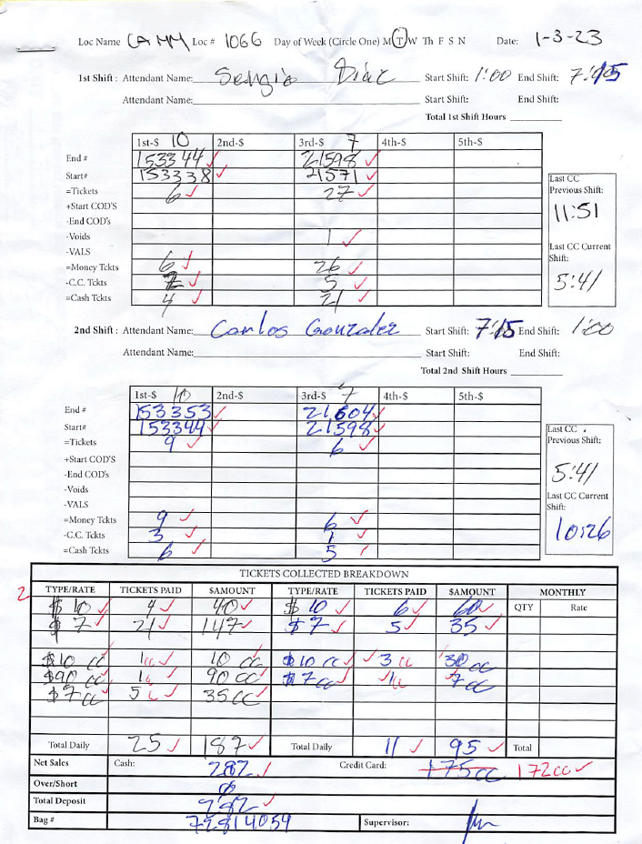
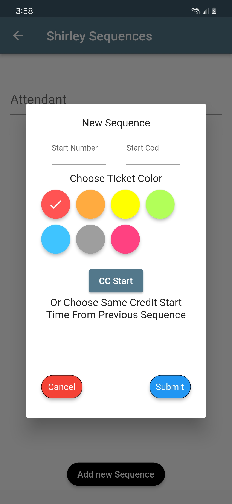
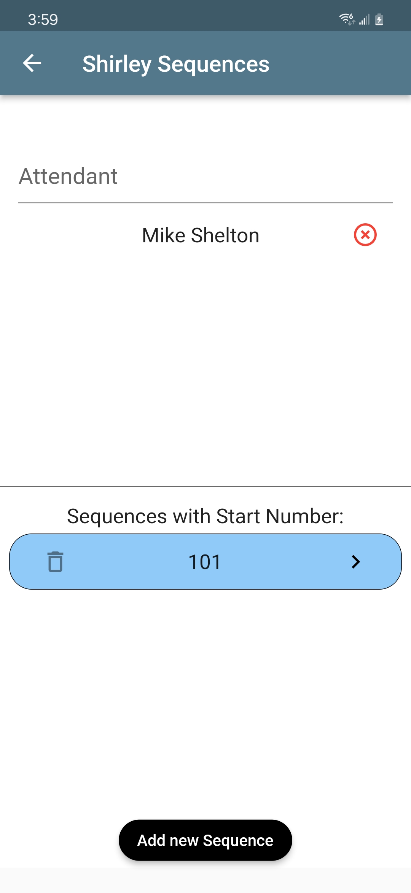
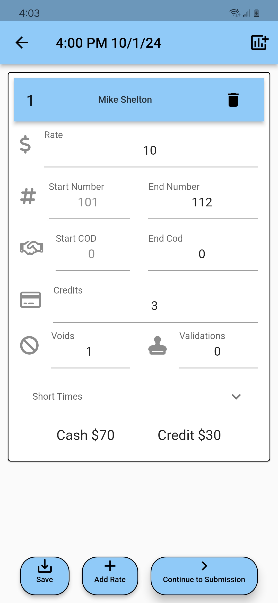
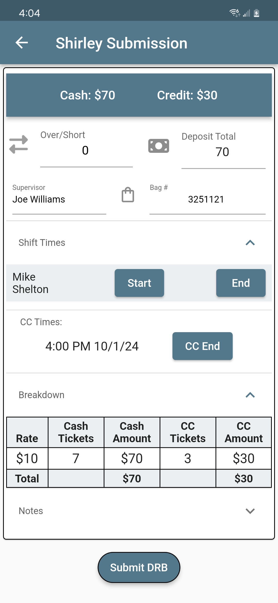
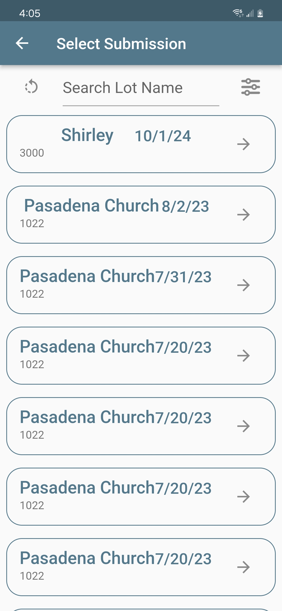
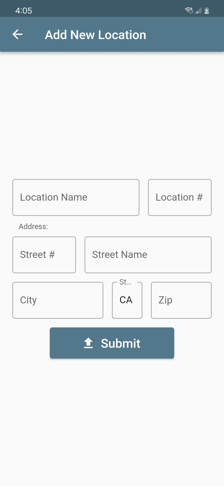
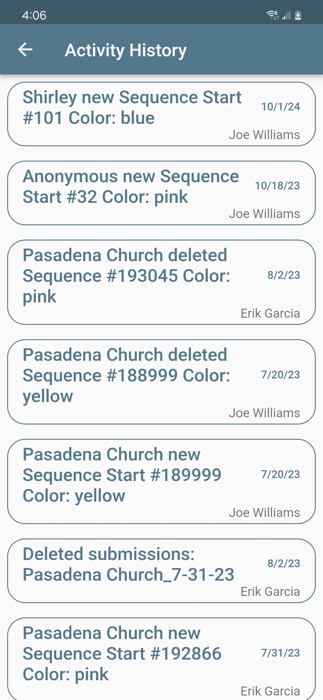
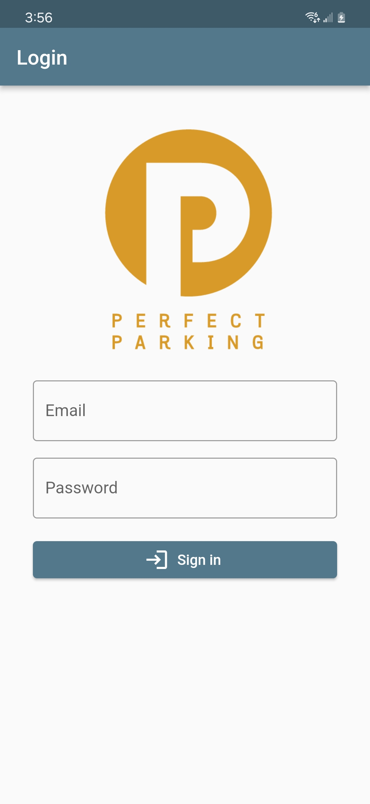
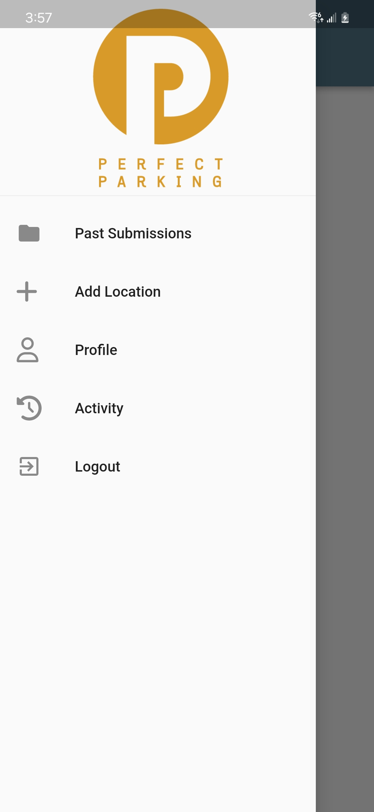

- [Introduction](#introduction)
- [Problems](#problems)
- [Features](#features)
- [Wiki](#wiki)
- [Screenshots](#screenshots)
- [Technologies](#technologies)
- [Contact](#contact)

# Introduction

- This application is a form submission and auditing system meant to improve the workflow for a parking company's daily revenue reconciliation.
- The codebase is adapted from my work experience at [Perfect Parking Inc.](https://www.perfectparkingla.com/)
- I am publishing this repository, with permission from ownership at Perfect Parking, in order to share to the Flutter and open-source community, spread interest in freelance development for small businesses, and showcase my work.

# Problems

Example of the paper form:

 

With this example in mind listed next are potential or current issues the application aims to address:

- Frontend - Completing the forms
    1. **Security** - with pen and paper forms there was more room for potential fraud as well as no geofencing
    2. **Redundancy** - many of the fields being manually written could be automated: time, date, location, prior transactions
    3. **Consistency** - across different locations some form fields were used differently than others
    4. **Legibility** - after a busy day with many rate changes the form could become difficult to comprehend
    5. **Complex** - real time prompts and feedback on the app make it more simple to complete than the paper forms as well as completing all necessary calculations
- Backend - Handling completed forms
    1. **Verification** - all paper forms must be manually audited to verify accuracy of data and deposit information, something automatically ensured by the structure of the application
    2. **Delay** - real time metrics are slower and more difficult to track since form collection and processing happens at the end of the month
    3. **Distribution** - paper forms had to be manually scanned and emailed to clients, a time consuming process with inferior data visualizations compared to the app
    4. **Accuracy** - human error could still exist in calculation process
    5. **Storage and Organization** - Paper forms require physical storage space and can easily be lost or damaged, whereas digital forms are automatically organized, stored securely, and can be retrieved instantly.

# Features
  - Geofencing to enforce security of form edits
  - Offline file storage with conversion to csv
  - Built-in audit ability to guarantee valid form submissions
  - Activity tracking and site performance metrics
  - Ability to start completing the form, save, and return later to complete

# Wiki
The [wiki]() contains detailed info on app usage and capabilities. Section Outlines for the wiki are below:
1. Form Submission Flow
     - Beginning a new Sequence
     - Continuing on an existing Sequence
     - Handling credit card and short time transactions
     - Handling sequence and rate changes
     - Submitting
2. Admin Drawer
     - Viewing and downloading prior submissions
     - Adding a location
     - Current user options
     - Activity log
     - Logout
  
# Screenshots

- Form Submission Flow

 
 
 
 
 

   <!-- Line breaks for space -->

- Admin Console

 
 
 

   <!-- Line breaks for space -->

- Additional Screens

 
 

# Technologies
1. Flutter
    - The primary framework used for building the app. Flutter allows for cross-platform development.
2. Firebase
    - A comprehensive app development platform that provides a real-time database, authentication, cloud storage, and hosting.
    - Firebase Firestore: For storing and syncing data in real time.
    - Firebase Authentication: To manage user authentication securely.
  
# Contact
Guidelines for contributing to the project.
